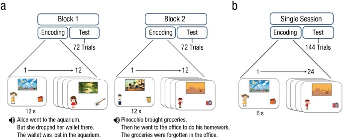
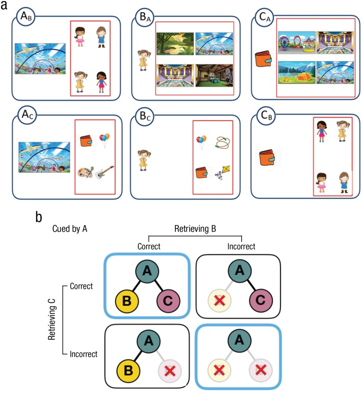
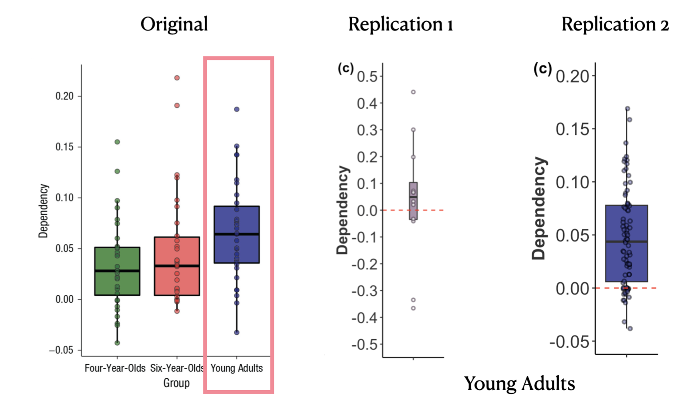

<!-- Replication reports should all use this template to standardize reporting across projects.  These reports will be public supplementary materials that accompany the summary report(s) of the aggregate results. -->

## Introduction

I plan to rescue a study by Ngo et al. (2019), which is in the field of cognitive developmental psychology. The study focuses on the interconnectedness of memory components and how cueing one aspect of a memory can aid in retrieving other parts of the same memory.

I am planning to gather data from at least 31 young adults using Prolific. This is an attempt to not only match but exceed the sample size of the study (N = 31). The experiment will present participants with a variety of stimuli including images of familiar cartoon characters like Cinderella and Moana, cartoon illustrations of everyday objects such as a jump rope or a watch, and cartoon settings that can either be indoors like a bedroom or outdoors like a playground. Using this combination of stimuli, I will generate 24 unique events. Each event will include one character, object, and scene, and will be shown to participants for a duration of six seconds - this is the encoding or memory-building phase. Right after this phase, participants will complete a memory task. They will be given a cue from one of the events (either a character, object, or scene) and given four options to choose from. Of these, one will be the correct association from the encoding phase, while the other three will be distractions. 

Project repository: https://github.com/psych251/ngo19_rescue

Original paper: https://github.com/psych251/ngo19_rescue/blob/main/original_paper/ngo-et-al-2019-development-of-holistic-episodic-recollection.pdf

Experimental Paradigm: http://173.236.204.40/st/ngo19rep/index.html?PROLIFIC_PID=final&STUDY_ID=1&SESSION_ID=final

Pre-registration: https://osf.io/r39ye/

## Summary of prior replication attempt

In comparing the methodologies between the original study and the 1st replication, I noticed 3 main differences. First, the original study had a larger participant pool of 31 individuals, whereas the replication was conducted with a notably smaller group of just 12 participants. This decision in the replication was influenced by effect size considerations: while the original study reported an effect size of 1.32, the replication aimed for an effect size of 0.8. This reduction in the targeted effect size may have implications for the study's power and sensitivity. Additionally, the testing environments differed between the original study and the 1st replication. In the original, participants used a 13-inch laptop screen in a controlled setting. In the replication, participants did the experiment remotely on their own laptop or desktop. This means the replication couldn't control for screen size, resolution, or potential distractions in participants' environments.

## Methods

### Power Analysis

The original study reported an effect size of d=1.32. To determine an appropriate sample size for my study, I utilized G\*Power analysis. The analysis revealed that to achieve an 80% power level, a sample size of 6 is needed; for 90% power, the sample size increases to 7, and for 95% power, it reaches 8. However, the previous replication attempt with 12 participants reported a significantly lower effect size of d=0.15. Given this reduced effect size, the G\*Power analysis showed that 277 participants would be necessary to maintain an 80% power level. This number is not feasible due to budget constraints. Therefore, I will be using the Small Telescopes approach (Simonsohn, 2014), which involves increasing the sample size to 2.5 times that of the original study.

### Planned Sample

I planned to have a sample size of at least N = 31 but with considerations to the power analysis above and the small telescopes method, I will collect 77 participants, since that is 2.5 times the original sample size. In Prolific, I will set the following parameters: participants must be located in the USA, aged 18-31 years old, have English as their first language, and possess normal or corrected vision, with no issues of color blindness; additionally, I will ensure a balanced sample of males and females.

### Materials

I will precisely follow the methods quoted directly from the original study in my experiment.

"We sampled 24 cartoon images of distinct scenes (12 indoor scenes, e.g., an aquarium; 12 outdoor scenes, e.g., a playground), 24 cartoon images of com- mon objects (e.g., a watch), and 24 images of cartoon characters from nonoverlapping movies or books (12 males, e.g., Pinocchio; 12 females, e.g., Alice) from the Google Images search engine. From this pool of selected images, we then constructed 24"events," each consist- ing of a scene (e.g., an aquarium), a person (e.g., Alice), and an object (e.g., a wallet). The event assignment of the elements was randomized, with the exception that items with preexperimental associations (e.g., books and library) were not assigned to the same event. Every possible cue--test combination of each event was tested, resulting in six test trials per event (1 = cue: scene, test: person; 2 = cue: scene, test: object; 3 = cue: person, test: scene; 4 = cue: person, test: object; 5 = cue: object, test: scene; 6 = cue: object, test: person) and totaling 144 test trials."

**Procedure**

In my experiment, I will adhere closely to the methods directly quoted from the original study. While the original study was conducted in-person on a 13-inch laptop screen---likely aiding in attention control and minimizing external distractions---I will ensure participants use only a laptop or desktop. Additionally, the experiment will automatically launch in fullscreen mode and notify me if a participant exits this mode.

"All participants were tested individually. The task procedure administered to children consisted of two encoding-test blocks, which occurred immediately after one another. Each block consisted of 12 encoding and 72 test trials, all presented on a 13-in. laptop screen. Prior to encoding, participants were told that they would see many different stories and that they should pay close attention to all of the different elements, including the scene, person, and object in each story. Then, participants viewed a series of events (12 s each; 0.5 s intertrial interval). A short audio-recorded narrative accompanied each event (e.g.,"Alice went to the aquarium, but she dropped her wallet there; the wallet was lost in the aquarium"; see [Fig. 1a](https://www.ncbi.nlm.nih.gov/pmc/articles/PMC7137142/figure/fig1-0956797619879441/)). Each narrative consisted of three sentences, with each sentence highlighting one pairwise association within the event. The order of the pairwise associations within each narrative was not fixed or counterbalanced across the events. The narrative was constructed this way to engage children in the task and to increase the likelihood that children would pay attention to all of the elements in an event. Prior to encoding, we provided one example (a playground, Elastigirl, a hat) in order to acquaint the participants with the encoding task.

Immediately after the encoding phase of each block, participants performed a self-paced four-alternative forced-choice task. We tested participants on every possible cue--retrieval combination of each studied event, resulting in 6 test trials per event, which totaled 72 test trials per block. On each trial, a cue and four options were presented simultaneously on the screen (see [Fig. 2a](https://www.ncbi.nlm.nih.gov/pmc/articles/PMC7137142/figure/fig2-0956797619879441/)). Among four options, one was a target---the correct item because it belonged to the same event as the cue. The three lures were same-category elements from different events. The lures always came from the events that contained same-sex characters, so that participants could not eliminate lures on the basis of general mnemonic heuristics (e.g., remembering that there was a female character who went to the aquarium). Across all 24 events, any two test trials that had overlapping cue items (e.g., A~B~^[1](https://www.ncbi.nlm.nih.gov/pmc/articles/PMC7137142/#fn1-0956797619879441)^ and A~C~^[1](https://www.ncbi.nlm.nih.gov/pmc/articles/PMC7137142/#fn1-0956797619879441)^) or in which tested items (e.g., B~A~^[1](https://www.ncbi.nlm.nih.gov/pmc/articles/PMC7137142/#fn1-0956797619879441)^ and C~A~^[1](https://www.ncbi.nlm.nih.gov/pmc/articles/PMC7137142/#fn1-0956797619879441)^) shared only one foil item (out of three) with respect to their event membership. For example, for the A~B~ test trial of Event 1, the foils included the B elements from Events 2, 3, and 4, whereas for the A~C~ trial of Event 1, the foils included the C elements from Events 3, 5, and 7 (one B and one C foil, both from Event 3). Furthermore, all items served as foils an equal number of times across all 144 test trials. Children were asked to point to one of the four options that belonged to the same story as the cue on the left side of the screen. Positions of the correct answer were counterbalanced across the entire test phase. There were no missing responses, as the response time was unrestricted. The memory task took approximately 40 min.

The adult task procedure was similar to the child task procedure but with a few differences. First, the whole procedure was administered in a single session comprising 24 encoding events and 144 test trials. Second, no narratives were implemented at the encoding phase to avoid potential ceiling performance in young adults. Third, each encoding trial was presented for 6 s (see [Fig. 1b](https://www.ncbi.nlm.nih.gov/pmc/articles/PMC7137142/figure/fig1-0956797619879441/))."



[Fig. 1.](https://www.ncbi.nlm.nih.gov/pmc/articles/PMC7137142/figure/fig1-0956797619879441/)

Procedure of the child (a) and adult (b) multielement-event task. In the child task, participants viewed 24 events presented in two encoding sessions, each consisting of 12 events. Each event lasted 12 s and was accompanied by an audio-recorded narrative. The test phase of each block consisted of 72 test trials. In the adult task procedure, participants studied 24 events (6 s each) together and without the recorded narrative. The test phase consisted of 144 test trials. Note that the characters shown in each event were well-known cartoon characters (e.g., Alice, Pinocchio), which have been replaced in this illustration for copyright concerns.



[Fig. 2.](https://www.ncbi.nlm.nih.gov/pmc/articles/PMC7137142/figure/fig2-0956797619879441/)

A schematic depiction of the task design and the 2 × 2 contingency table used to estimate retrieval dependency. Examples of six retrieval types per event in the test phase are shown in (a). Each element of a studied event took a turn serving as the cue (item presented on the left side of the screen) and the tested element (one of the four options presented inside the red box). The schematic (b) shows how the proportion of joint retrieval for AB and AC pairs was computed for each participant. The contingency table shows the proportion of events that fell within each of the four categories: Both AB and AC pairs were retrieved correctly, both AB and AC pairs were retrieved incorrectly, AB was retrieved correctly and AC was retrieved incorrectly, and AB was retrieved incorrectly and AC was retrieved correctly. The proportion of events in the blue-outlined boxes (both pairs correct and both pairs incorrect) were added, and the sum was divided by the total number of events. Note that the characters shown in each event were well-known cartoon characters (e.g., Alice, Pinocchio), which have been replaced in this illustration for copyright concerns.

### Controls

To confirm that participants are actively engaged and attentive throughout the experiment, I will introduce key press attention checks every 4 trials. For these checks, participants will be prompted with instructions like, "Please press the \[chosen key\] key to continue." The chosen keys for these checks will be diverse, including "j", "k", "f", "d", "s", and "a", to prevent any rote memorization or autopilot responses. These attention checks will help filter out participants who might not be genuinely engaged in the task, ensuring that our data reflects genuine cognitive responses.

### Analysis Plan

I will conduct the following analysis precisely as directly quoted below with the young adult group. Although this quote mentions conducting a one-sample t test for 4 to 6 year olds, the original authors did the same analysis for their young adult pool as well.

"The primary questions of this research were whether holistic recollection is evident at the ages of 4 and 6 years, during a crucial developmental window of robust gains in episodic memory, and whether holistic recollection changes with age. To answer the first question, **we conducted a one-sample *t* test** to determine whether dependency (data -- independent model) exceeded zero for each age group."

**To clarify the key test I will be running in my own words, I will conduct a one-sample t-test to determine if the mean dependency (difference between data and independent model) in my study significantly exceeds zero, which would indicate holistic recollection. I will be testing the 'Dependency' variable computed from the proportions of joint retrieval for different item pairs.**

### Differences from Original Study and 1st replication

The original study was conducted with 31 participants in a controlled, in-person setting using a 13-inch laptop. In contrast, the first replication used a smaller sample size of 12 participants and was administered remotely via Prolific, allowing participants to use any size of laptop or desktop. Both studies followed the same analysis plan.

### Methods Addendum (Post Data Collection)

#### Differences from pre-data collection methods plan

There were no differences from pre-data collection methods plan.

## Results

```{r setup, include=FALSE}
knitr::opts_chunk$set(echo = TRUE)
```

### Data preparation

```{r}
## Load Relevant Libraries and Functions
library(tidyverse)
library(BayesFactor)

## Import data
### get all data files from directory
data_files <- list.files(file.path("~/Desktop/ngo19_rescue/data"), pattern = "*.csv", full.names = TRUE)

### read individual data files to list
all_data <- lapply(data_files, read.csv)

### unpack list as singular tidy data frame
all_data <- all_data |>
  map_df(as_tibble)

if(!221 %in% all_data$trial_index) {
  print("Trial index 221 is missing after import.")
} else {
  print("Trial index 221 is present after import.")
}
```

```{r}

### try 31 participants as original study
# data_files <- list.files(file.path("~/Desktop/ngo19_rescue/exp/data"), pattern = "*.csv", full.names = TRUE)

### randomly sample 31 files
# # selected_files <- sample(data_files, 31)
# 
# selected_data <- lapply(selected_files, read.csv)

# all_data <- selected_data |> 
#   map_df(as_tibble)
# 
# if(!221 %in% all_data$trial_index) {
#   print("Trial index 221 is missing after import.")
# } else {
#   print("Trial index 221 is present after import.")
# }

```

```{r}
### unpack participant demographics
demographics_trials <- all_data |>
  subset(trial_type == "survey-html-form")

### string together json strings
json_text <- paste0(demographics_trials$response, collapse = ',')
json_text <- paste0('[', json_text, ']')

### unpack json as data frame
demographics_trials <- jsonlite::fromJSON(json_text) |>
  as_tibble() |>
  mutate(subject_id = rownames(demographics_trials), .before = "Gender")

### get participant demographic stats
#### age
mean_age <- mean(as.numeric(demographics_trials$Age))
sd_age <- sd(as.numeric(demographics_trials$Age))
min_age <- min(as.numeric(demographics_trials$Age))
max_age <- max(as.numeric(demographics_trials$Age))

#### gender
table(demographics_trials$Gender)
```

#### Actual Sample

I collected data from *n* = 77, *M* = `r round(mean_age, 2)` years, *SD* = `r round(sd_age, 2)`, range: `r min_age`-`r max_age`; `r table(demographics_trials$Gender)[1]` females, `r table(demographics_trials$Gender)[2]` males, and `r table(demographics_trials$Gender)[3]` individual who preferred not to answer (compared to the original *n* = 31 undergraduate students; 18 female, *M* = 20.65 years, *SD* = 3.23, range 18-31; @ngo2019development). All participants were located in the US, aged 18-31 years old, had English as their first language, and possessed normal or corrected vision, with no issues of color blindness.

```{r}
## Data exclusion / filtering
### clean data into long format

all_data_cleaned <- all_data |>
  group_by(subject_id) |> 
  #filter(row_number() > 78 & row_number() <= 221) |> 
  #slice(78:221) |>
  filter(trial_index >= 78 & trial_index <= 221) |>
  ungroup() |>
  filter(!is.na(correct))

if(!221 %in% all_data_cleaned$trial_index) {
  print("Trial index 221 is missing")
} else {
  print("Trial index 221 is present")
}

```

```{r}


# Group the cleaned data by subject_id, then count the number of rows for each group
participant_row_counts <- all_data_cleaned |>
  group_by(subject_id) |>
  summarise(num_rows = n())


# Print the row counts to see the number of rows for each participant
print(participant_row_counts)

all_data_cleaned <- all_data_cleaned |>
  mutate(accuracy = ifelse(correct, 1, 0)) |>
  select(subject_id, trial_index, time_elapsed, rt, stimulus, task,
         retrieval_group, response, correct_response, correct, accuracy) |>
  separate(stimulus, c(NA, NA, NA, NA, "id"), sep = "_", remove = FALSE, extra = "merge", fill = "right")

if(!221 %in% all_data_cleaned$trial_index) {
  print("Trial index 221 is missing")
} else {
  print("Trial index 221 is present")
}


```

```{r}
# Calculate accuracy summaries
accuracy_summary <- all_data_cleaned |>
  filter(task == "response") |> 
  group_by(retrieval_group) |>
  summarise(mean = mean(accuracy), sd = sd(accuracy), n = n(), sem = sd/sqrt(n))

print(accuracy_summary)


```

```{r}
## Prepare data for analysis - create columns 
### compute individual accuracy by grouping
accuracy_summary <- all_data_cleaned |>
  filter(task == "response") |> # only use retrieval data
  group_by(retrieval_group) |>
  summarise(mean = mean(accuracy), sd = sd(accuracy), n = n(), sem = sd/sqrt(n))

```

```{r}
### compute accuracy by participant
accuracy_summary_part <- all_data_cleaned |>
  filter(task == "response") |> # only use retrieval data
  group_by(subject_id) |>
  summarise(mean = mean(accuracy), sd = sd(accuracy), n = n(), sem = sd/sqrt(n))

### compute overall accuracy
overall_accuracy_summary <- all_data_cleaned |>
  filter(task == "response") |> # only use retrieval data
  summarise(mean = mean(accuracy), sd = sd(accuracy), n = n(), sem = sd/sqrt(n))


### compute Ab_Ac_Accuracy
Ab_Ac_Accuracy <- all_data_cleaned |>
  filter(task == "response") |> # only use retrieval data
  filter(retrieval_group == "Ab" | retrieval_group == "Ac") |>
  group_by(subject_id) |>
  summarise(mean = mean(accuracy))


### compute Ba_Bc_Accuracy
Ba_Bc_Accuracy <- all_data_cleaned |>
  filter(task == "response") |> # only use retrieval data
  filter(retrieval_group == "Ba" | retrieval_group == "Bc") |>
  group_by(subject_id) |>
  summarise(mean = mean(accuracy))

### compute Ca_Cb_Accuracy
Ca_Cb_Accuracy <- all_data_cleaned |>
  filter(task == "response") |> # only use retrieval data
  filter(retrieval_group == "Ca" | retrieval_group == "Cb") |>
  group_by(subject_id) |>
  summarise(mean = mean(accuracy))

### compute Ba_Ca_Accuracy
Ba_Ca_Accuracy <- all_data_cleaned |>
  filter(task == "response") |> # only use retrieval data
  filter(retrieval_group == "Ba" | retrieval_group == "Ca") |>
  group_by(subject_id) |>
  summarise(mean = mean(accuracy))

### compute Ac_Bc_Accuracy
Ac_Bc_Accuracy <- all_data_cleaned |>
  filter(task == "response") |> # only use retrieval data
  filter(retrieval_group == "Ac" | retrieval_group == "Bc") |>
  group_by(subject_id) |>
  summarise(mean = mean(accuracy))

### compute Ab_Cb_Accuracy
Ab_Cb_Accuracy <- all_data_cleaned |>
  filter(task == "response") |> # only use retrieval data
  filter(retrieval_group == "Ab" | retrieval_group == "Cb") |>
  group_by(subject_id) |>
  summarise(mean = mean(accuracy))

### compute 6 2x2 contingency tables for retrieval dependency key analysis

#### define dependent model function
compute_data_model <- function(group_one, group_two, num_events = 24) {
  test_set <- all_data_cleaned |>
    filter(task == "response") |> # only use retrieval data
    select(subject_id, id, retrieval_group, accuracy) |> # select only the necessary columns
    filter(retrieval_group == group_one | retrieval_group == group_two) |> # filter out relevant groups from function params
    pivot_wider(id_cols = c(subject_id, id), names_from = retrieval_group, values_from = accuracy) |> # make long data frame wide for data dependent calculations
    rowwise() |>
    mutate(sum = sum(eval(parse(text = group_one)) + eval(parse(text = group_two)))) # get sums to compute all_correct and all_incorrect proportion of contingency table
  

  # get unique participants
  ps <- unique(all_data_cleaned$subject_id)
  data_models <- rep(NA, length(ps))
  
  for(ii in 1:length(ps)) {
    # get data for just the one participant in the loop
    data_subset <- test_set |>
      filter(subject_id == ps[ii])
    
    # get proportion of all correct
    prop_all_correct <- sum(data_subset$sum == 2) / num_events
    
    # get proportion of all incorrect
    prop_all_incorrect <- sum(data_subset$sum == 0) / num_events
    
    # compute data model and store per participant
    data_model_calc <- prop_all_correct + prop_all_incorrect
    data_models[ii] <- data_model_calc 
  }
  
  return(data_models)
}

#### 1) compute Data_Ab_Ac
Data_Ab_Ac <- compute_data_model("Ab", "Ac")

#### 2) compute Data_Ba_Bc
Data_Ba_Bc <- compute_data_model("Ba", "Bc")

#### 3) compute Data_Ca_Cb
Data_Ca_Cb <- compute_data_model("Ca", "Cb")

#### 4) compute Data_Ba_Ca
Data_Ba_Ca <- compute_data_model("Ba", "Ca")

#### 5) compute Data_Ac_Bc
Data_Ac_Bc <- compute_data_model("Ac", "Bc")

#### 6) compute Data_Ab_Cb
Data_Ab_Cb <- compute_data_model("Ab", "Cb")

#### define independent model function
compute_ind_model <- function(group_one, group_two) {
  P_AB <- all_data_cleaned |>
    filter(retrieval_group == group_one) |>
    group_by(subject_id) |>
    summarise(mean = mean(accuracy))

  P_AC <- all_data_cleaned |>
    filter(retrieval_group == group_two) |>
    group_by(subject_id) |>
    summarise(mean = mean(accuracy))

  cor_cor <- P_AB$mean * P_AC$mean
  incor_cor <- P_AC$mean * (1 - P_AB$mean)
  cor_incor <- P_AB$mean * (1 - P_AC$mean)
  incor_incor <- (1 - P_AB$mean) * (1 - P_AC$mean)

  return(cor_cor + incor_incor)
}

#### 1) compute Independent_Model_Ab_Ac
Independent_Model_Ab_Ac <- compute_ind_model("Ab", "Ac")

#### 2) compute Independent_Model_Ba_Bc
Independent_Model_Ba_Bc <- compute_ind_model("Ba", "Bc")

#### 3) compute Independent_Model_Ca_Cb
Independent_Model_Ca_Cb <- compute_ind_model("Ca", "Cb")

#### 4) compute Independent_Model_Ba_Ca
Independent_Model_Ba_Ca <- compute_ind_model("Ba", "Ca")

#### 5) compute Independent_Model_Ac_Bc
Independent_Model_Ac_Bc <- compute_ind_model("Ac", "Bc")

#### 6) compute Independent_Model_Ab_Cb
Independent_Model_Ab_Cb <- compute_ind_model("Ab", "Cb")

#### 1) compute Dependency_AbAc
Dependency_AbAc <- Data_Ab_Ac - Independent_Model_Ab_Ac

#### 2) compute Dependency_BaBc
Dependency_BaBc <- Data_Ba_Bc - Independent_Model_Ba_Bc
  
#### 3) compute Dependency_CaCb
Dependency_CaCb <- Data_Ca_Cb - Independent_Model_Ca_Cb
  
#### 4) compute Dependency_BaCa
Dependency_BaCa <- Data_Ba_Ca - Independent_Model_Ba_Ca

#### 5) compute Dependency_AcBc
Dependency_AcBc <- Data_Ac_Bc - Independent_Model_Ac_Bc
  
#### 6) compute Dependency_AbCb
Dependency_AbCb <- Data_Ab_Cb - Independent_Model_Ab_Cb

### compute Collapsed_Data
total_data_model <- (Data_Ab_Ac + Data_Ba_Bc + Data_Ca_Cb + Data_Ba_Ca + Data_Ac_Bc + Data_Ab_Cb) / 6

### compute Collapsed_Ind_Model
total_ind_model <- (Independent_Model_Ab_Ac + Independent_Model_Ba_Bc + Independent_Model_Ca_Cb + Independent_Model_Ba_Ca + Independent_Model_Ac_Bc + Independent_Model_Ab_Cb) / 6

### compute Dependency
Dependency <- total_data_model - total_ind_model
Dependency

Dependency_avg <- mean(Dependency)
Dependency_avg

## construct complete data frame with all relevant stats summarized for each participant
summary_data <- data.frame(subject_id = accuracy_summary_part$subject_id,
                           Accuracy_mean = accuracy_summary_part$mean,
                           Accuracy_sd = accuracy_summary_part$sd,
                           Accuracy_sem = accuracy_summary_part$sem,
                           Accuracy_n = accuracy_summary_part$n,
                           Accuracy_AbAc = Ab_Ac_Accuracy$mean,
                           Accuracy_BaBc = Ba_Bc_Accuracy$mean,
                           Accuracy_CaCb = Ca_Cb_Accuracy$mean,
                           Accuracy_BaCa = Ba_Ca_Accuracy$mean,
                           Accuracy_AcBc = Ac_Bc_Accuracy$mean,
                           Accuracy_AbCb = Ab_Cb_Accuracy$mean,
                           Data_AbAc = Data_Ab_Ac,
                           Data_BaBc = Data_Ba_Bc,
                           Data_CaCb = Data_Ca_Cb,
                           Data_BaCa = Data_Ba_Ca,
                           Data_AcBc = Data_Ac_Bc,
                           Data_AbCb = Data_Ab_Cb,
                           Independent_AbAc = Independent_Model_Ab_Ac,
                           Independent_BaBc = Independent_Model_Ba_Bc,
                           Independent_CaCb = Independent_Model_Ca_Cb,
                           Independent_BaCa = Independent_Model_Ba_Ca,
                           Independent_AcBc = Independent_Model_Ac_Bc,
                           Independent_AbCb = Independent_Model_Ab_Cb,
                           Dependency_AbAc = Dependency_AbAc,
                           Dependency_BaBc = Dependency_BaBc,
                           Dependency_CaCb = Dependency_CaCb,
                           Dependency_BaCa = Dependency_BaCa,
                           Dependency_AcBc = Dependency_AcBc,
                           Dependency_AbCb = Dependency_AbCb,
                           Data_model_overall = total_data_model,
                           Independent_model_overall = total_ind_model,
                           Dependency_overall = Dependency)

DT::datatable(summary_data)


## count number of participants to exclude for having overall task accuracy == 100%
perfect_acc_exclusions_idx <- which(summary_data$Accuracy_mean == 1)
if(length(perfect_acc_exclusions_idx) > 0) {
  summary_data_w_exclusions <- summary_data[perfect_acc_exclusions_idx,]
} else {
  print("No exclusions based on accuracy made!")
}
num_acc_exclusions <- length(perfect_acc_exclusions_idx)
num_acc_exclusions
print("Final dataset check before exclusions:")
print(head(all_data_cleaned))
```

### Confirmatory Analysis

```{r}
if(any(is.na(Dependency)) | any(is.nan(Dependency))) {
  print("Dependency contains NA or NaN values, which are not valid for t-test.")
} else {
### testing key confirmatory analysis
key_test <- t.test(Dependency, alternative = "greater", mu = 0)
print(key_test)

### get bayes factor for key confirmatory analysis t-test
key_test_bf <- ttestBF(Dependency, mu = 0, nullInterval = c(0, Inf))
print(key_test_bf)
print(1/key_test_bf) ## BF in support of the null
}

```

### Retrieval Dependency Results

I conducted a one-sample *t*-test to determine whether dependency (data -- independent model) exceeded zero for young adults, which indicated that there was a significant difference for retrieval dependency scores greater than the test value of zero, *t*(`r key_test$parameter`) = `r round(key_test$statistic, 2)`, *p* \< 0.033, Cohen's *d* = `r round(effectsize::cohens_d(key_test)$Cohens_d, 2)`, 95% confidence interval (CI) = \[`r round(effectsize::cohens_d(key_test)$CI_low, 2)`, `r as.character(effectsize::cohens_d(key_test)$CI_high)`\], $BF_{01}$ = 2.25, *M* = `r round(mean(summary_data$Dependency_overall), 2)`, *SD* = `r round(sd(summary_data$Dependency_overall), 2)`, *SEM* = `r round((sd(summary_data$Dependency_overall) / sqrt(12)), 2)`, 95% CI = \[`r round(mean(summary_data$Dependency_overall) - qnorm(0.975)*sd(summary_data$Dependency_overall)/sqrt(12), 2)`, `r round(mean(summary_data$Dependency_overall) + qnorm(0.975)*sd(summary_data$Dependency_overall)/sqrt(12), 2)`\] (see Figure 6c). Original data from [@ngo2019development]: *M* = .07, *SD* = .05, *SEM* = .01, 95% CI = \[.05, .08\].

#### Overall Accuracy

```{r}
## compute 95% CI of acc mean assuming normal distribution
acc_mean <- mean(summary_data$Accuracy_mean)
acc_sd <- sd(summary_data$Accuracy_mean)
n <- 12
error <- qnorm(0.975)*acc_sd/sqrt(n)
lower_ci <- acc_mean - error
upper_ci <- acc_mean + error
```

#### Proportion of Joint Retrieval

```{r}
### Overall Accuracy
#### make plot
acc_plot <- ggplot(summary_data, aes(x = "", y = Accuracy_mean)) +
  geom_boxplot(width = 0.8, color = "black", fill = "#4c4fa2", outlier.shape = NA) +
  geom_jitter(width = 0.07, col = "black", fill = "#4c4fa2", alpha = .5, shape = 21, size = 1, stroke = 1) +
  xlab(" ") +
  ylab("Overall Accuracy") +
  scale_y_continuous(breaks = seq(0.25, 1.00, 0.25), limits = c(0.25, 1.00)) +
  theme_classic() +
  theme(panel.grid = element_blank(),
        panel.border = element_blank(),
        legend.title = element_blank(),
        legend.text = element_text(color = "grey20", size = 12),
        axis.text.x = element_text(color = "grey20", size = 16),
        axis.text.y = element_text(color = "grey20", size = 16),  
        axis.title.x = element_text(color = "grey20", size = 16, face = "bold"),
        axis.title.y = element_text(color = "grey20", size = 16, vjust = 0.5, face = "bold"))


### Proportion of Joint Retrieval
#### get relevant data in long format
summary_data_joint_ret_long <- pivot_longer(summary_data,
                                            c(Data_model_overall, Independent_model_overall),
                                            names_to = "source",
                                            values_to = "prop_joint_retrieval") |>
  rowwise() |>
  mutate(source_cleaned = ifelse(source == "Data_model_overall", "Data", "Ind. Model")) |>
  select(subject_id, source, source_cleaned, prop_joint_retrieval)

#### make plot
ret_plot <- ggplot(summary_data_joint_ret_long, aes(x = source_cleaned, y = prop_joint_retrieval, fill = source_cleaned)) +
  geom_boxplot(width = 0.3, outlier.shape = NA, position = position_dodge(1)) +
  geom_jitter(aes(col = source_cleaned, x = source_cleaned), position = position_jitter(width = 0.07), alpha = .7, shape = 21, size = 1, stroke = 1) +
  xlab("Young Adults") +
  ylab("Proportion of\nJoint Retrieval") +
  scale_y_continuous(breaks = seq(0.40, 1.00, 0.1), limits = c(0.40, 1.00)) +
  scale_fill_manual(values = c("#ad93ad", "#dbb5d6")) +
  scale_color_manual(values = c("#5c475b", "#573350")) +
  theme_classic() +
  theme(panel.grid = element_blank(),
        panel.border = element_blank(),
        legend.title = element_blank(),
        legend.text = element_text(color = "grey20", size = 10),
        legend.position = "none",
        axis.text.x = element_text(color = "grey20", size = 13),
        axis.text.y = element_text(color = "grey20", size = 16),  
        axis.title.x = element_text(color = "grey20", size = 22, vjust = 0, face = "bold"),
        axis.title.y = element_text(color = "grey20", size = 16, vjust = 0.5, face = "bold"))


### Dependency
#### make plot
dep_plot <- ggplot(summary_data, aes(x = "", y = Dependency_overall)) +
  geom_boxplot(width = 0.8, fill = "#4c4fa2", outlier.shape = NA) +
  geom_jitter(width = 0.07, col = "black", fill = "#4c4fa2", alpha = .5, shape = 21, size = 1, stroke = 1) +
  geom_hline(yintercept = 0.0, col = "red", lty = "dashed") +
  xlab(" ") +
  ylab("Dependency") +
scale_y_continuous(breaks = seq(-0.05, 0.2, by = 0.05), limits = c(-0.05, 0.2)) +
  theme_classic() +
  theme(panel.grid = element_blank(),
        panel.border = element_blank(),
        legend.title = element_blank(),
        legend.text = element_text(color = "grey20", size = 12),
        axis.text.x = element_text(color = "grey20", size = 16),
        axis.text.y = element_text(color = "grey20", size = 16),  
        axis.title.x = element_text(color = "grey20", size = 16, face = "bold"),
        axis.title.y = element_text(color = "grey20", size = 16, vjust = 0.5, face = "bold"))

```

```{r data-replicated, fig.margin=TRUE, fig.cap='Fig: Attempted replication of key data from the current study. (a) Jittered distribution of overall accuracy on the cued-recognition memory task. (b) Jittered distribution of the proportion of joint retrieval for the actual data and the independent statistical model (Ind. Model). (c) Jittered distribution of retrieval dependency scores. The dashed red line on the figure indicates the test value of 0 used in the t-test (i.e., retrieval dependency scores significantly greater than 0).', out.width="100%", out.height="30%", echo=TRUE}
### Combine Plots for Rendered Report
ggpubr::ggarrange(acc_plot, ret_plot, dep_plot, ncol = 3, nrow = 1, widths = c(1,2,1),
                  labels = c('(a)', '(b)', '(c)'))
```





## Discussion

## Mini meta analysis

The third replication comes from Ngo et al. (2021), "Relational binding and holistic retrieval in ageing." 
https://www.tandfonline.com/doi/full/10.1080/09658211.2021.1974047

```{r}
library(metafor)

study_data <- data.frame(
study = c("Original", "First Replication", "Second Replication", "Third Replication"),
effect_size = c(1.32, 0.15, 0.21, 1.63), 
SE = c(0.07, 0.04, 0.05, 0.07), 
N = c(31, 12, 77, 24) 
)

study_data$variance <- (study_data$SE^2) / study_data$N

meta_analysis_results <- rma(yi = effect_size, vi = variance, data = study_data, method = "REML")
summary(meta_analysis_results)

```

*Combining across the original paper, 1st replication, 2nd replication, and 3rd replication, the aggregate effect size is 0.83.*

### Summary of Replication Attempt

In the second replication attempt of Ngo et al. (2019), a one-sample t-test revealed a significant retrieval dependency score greater than zero (t(76) = 1.87, p < 0.033), with a Cohen's d of 0.21. This result indicates a moderate effect of retrieval dependency within the sample, successfully replicating the findings of the original study.

A notable methodological distinction in this replication was the larger sample size, which likely contributed to the robustness and reliability of the results. Additionally, the implementation of attention check key presses every four encoding trials was an approach aimed at maintaining participant engagement and ensuring data accuracy throughout the experiment. I believe these enhancements may have been crucial in bolstering the validity of our findings.

However, it is important to note that when randomly subsampling 31 participants from the total of 77 I collected, the results were not significant. This outcome was observed in a single instance of subsampling, suggesting the need for further investigation. Repeated subsampling with different groups of 31 participants could provide insight into the consistency of the effect size across smaller samples. This approach would help in understanding the variability of the results and the influence of sample size on the significance of the findings.

Moreover, the introduction of a random effect per participant in future studies could offer a more nuanced way to handle outliers. This method would allow for a better understanding of individual differences and their impact on the overall results. 

